# Agent Marketplace Architecture

```mermaid
graph TB
    subgraph Frontend
        UI[Web Interface]
        Auth[Authentication]
        Store[State Management]
        API[API Client]
    end

    subgraph "AWS Infrastructure"
        subgraph "Network"
            ALB[Application Load Balancer]
            WAF[Web Application Firewall]
            VPC[VPC]
            Subnets[Private/Public Subnets]
        end

        subgraph "Compute"
            ECS[EC2/ECS]
            Lambda[Serverless Functions]
            EKS[EKS for ML Workloads]
        end

        subgraph "Storage"
            RDS[RDS PostgreSQL]
            Redis[ElastiCache Redis]
            VectorDB[OpenSearch]
            S3[S3 Storage]
        end

        subgraph "Security"
            IAM[IAM Roles]
            KMS[Key Management]
            SecretsManager[Secrets Manager]
        end

        subgraph "Monitoring"
            CloudWatch[CloudWatch]
            XRay[X-Ray]
            CloudTrail[CloudTrail]
        end

        subgraph "CI/CD"
            CodePipeline[CodePipeline]
            CodeBuild[CodeBuild]
            ECR[ECR]
        end
    end

    subgraph Backend
        subgraph "API Layer"
            Router[API Router]
            Controllers[Controllers]
            Middleware[Middleware]
        end

        subgraph Services
            Agent[Agent Service]
            Workflow[Workflow Service]
            Auth[Authentication Service]
            Cache[Cache Service]
        end
    end

    subgraph "External Services"
        OpenAI[OpenAI API]
        Anthropic[Anthropic API]
        OtherLLMs[Other LLMs]
    end

    %% Frontend to Backend
    UI --> Auth
    UI --> Store
    UI --> API
    Store --> API

    %% Backend Infrastructure
    ALB --> ECS
    ALB --> Lambda
    ALB --> EKS

    %% Backend Services
    Router --> Controllers
    Controllers --> Middleware
    Controllers --> Agent
    Controllers --> Workflow
    Controllers --> Auth
    Controllers --> Cache

    %% Service to Infrastructure
    Agent --> RDS
    Agent --> Redis
    Agent --> VectorDB
    Agent --> OpenAI
    Agent --> Anthropic
    Agent --> OtherLLMs

    Workflow --> RDS
    Workflow --> Redis
    Workflow --> VectorDB

    Auth --> RDS
    Auth --> Redis

    %% Infrastructure Connections
    ECS --> RDS
    ECS --> Redis
    ECS --> VectorDB
    ECS --> S3

    Lambda --> RDS
    Lambda --> Redis
    Lambda --> VectorDB
    Lambda --> S3

    EKS --> RDS
    EKS --> Redis
    EKS --> VectorDB
    EKS --> S3

    %% Security
    IAM --> ECS
    IAM --> Lambda
    IAM --> EKS
    KMS --> RDS
    KMS --> Redis
    KMS --> VectorDB
    SecretsManager --> Auth

    %% Monitoring
    CloudWatch --> ECS
    CloudWatch --> Lambda
    CloudWatch --> EKS
    XRay --> ECS
    XRay --> Lambda
    XRay --> EKS
    CloudTrail --> VPC

    %% CI/CD
    CodePipeline --> CodeBuild
    CodeBuild --> ECR
    ECR --> ECS
    ECR --> Lambda
    ECR --> EKS

    %% Component Details
    classDef frontend fill:#f9f,stroke:#333,stroke-width:2px
    classDef backend fill:#bbf,stroke:#333,stroke-width:2px
    classDef aws fill:#bfb,stroke:#333,stroke-width:2px
    classDef external fill:#fbb,stroke:#333,stroke-width:2px

    class UI,Auth,Store,API frontend
    class Router,Controllers,Middleware,Agent,Workflow,Auth,Cache backend
    class ALB,WAF,VPC,Subnets,ECS,Lambda,EKS,RDS,Redis,VectorDB,S3,IAM,KMS,SecretsManager,CloudWatch,XRay,CloudTrail,CodePipeline,CodeBuild,ECR aws
    class OpenAI,Anthropic,OtherLLMs external

    %% Legend
    subgraph Legend
        Frontend[Frontend Components]
        Backend[Backend Components]
        AWS[AWS Infrastructure]
        External[External Services]
    end

    class Frontend frontend
    class Backend backend
    class AWS aws
    class External external
```

## Component Details

### Frontend
- Modern web interface built with React/Vue
- State management for UI consistency
- Authentication handling
- API client for backend communication

### Backend
- FastAPI-based RESTful API
- Middleware for security and monitoring
- Services for business logic
- Database integration

### Services
- Agent Service: Manages AI agent operations
- Workflow Service: Handles workflow execution
- Authentication Service: User management
- Cache Service: Performance optimization

### Databases
- PostgreSQL: Main relational database
- Redis: Caching and session management
- OpenSearch: Vector database for embeddings

### External Integrations
- Multiple LLM providers
- Vector database integration
- Authentication services
